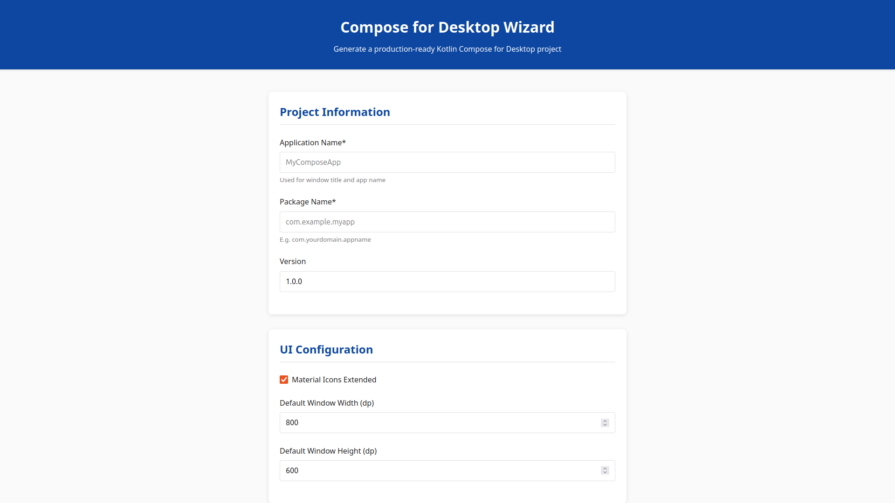
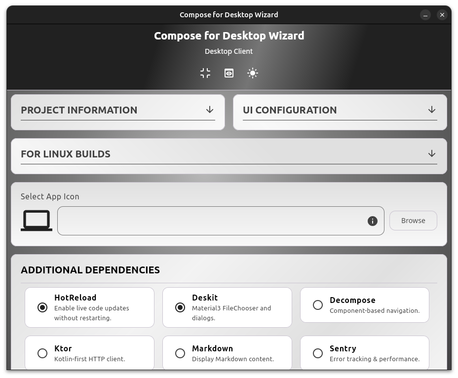

# Compose for Desktop Wizard


A project generator that creates ready-to-use Kotlin Compose for Desktop applications. Available as both a web application and a native desktop client.



## 🚀 Available Versions

### Web Generator (Instant Access)
**[Launch Web Generator](https://composefordesktop.vercel.app/)** - No installation required

### Desktop Client (Advanced Features)
**[Download Desktop Client](https://github.com/zahid4kh/compose-for-desktop/releases)** - Native application with enhanced capabilities



## Features Comparison

| Feature                   | Web Version | Desktop Client |
|---------------------------|-------------|----------------|
| **Project Generation**    | ✅           | ✅              |
| **Dependency Selection**  | ✅           | ✅              |
| **File Preview**          | ✅           | ✅              |
| **Dark Mode**             | ✅           | ✅              |
| **Icon Management**       | ❌           | ✅ Drag & Drop  |
| **Offline Usage**         | ❌           | ✅              |
| **Expandable Sections**   | ❌           | ✅              |
| **Installation Required** | ❌           | ✅ Java 17+     |

## Desktop Client Installation

### Prerequisites
- Java 17 or later ([Download from Oracle](https://www.oracle.com/java/technologies/javase/jdk17-archive-downloads.html))

### Quick Install

**Linux (Recommended)**
```bash
wget https://github.com/zahid4kh/compose-for-desktop/releases/latest/download/composefordesktop_1.0.0_all.deb
sudo dpkg -i composefordesktop_1.0.0_all.deb
```

**All Platforms (JAR)**
```bash
wget https://github.com/zahid4kh/compose-for-desktop/releases/latest/download/composefordesktop-1.0.0.jar
java -jar composefordesktop-1.0.0.jar
```

For detailed installation instructions, see the [Installation Guide](https://github.com/zahid4kh/compose-for-desktop/wiki/Installation).

## How It Works

Both versions create a customized Kotlin project with:

- Proper Gradle configuration with version catalogs
- Compose for Desktop dependencies
- Material 3 theming with dark mode support
- Dependency injection with Koin
- MVVM architecture pattern
- Cross-platform native distributions
- Optional libraries based on your selection

## 📁 Generated Project Structure

```text
.
├── build.gradle.kts
├── gradle
│   └── wrapper
│       ├── gradle-wrapper.jar
│       └── gradle-wrapper.properties
├── gradle.properties
├── gradlew
├── gradlew.bat
├── README.md
├── settings.gradle.kts
└── src
    ├── main
    │   ├── kotlin
    │   │   ├── App.kt
    │   │   ├── AppModule.kt
    │   │   ├── Database.kt
    │   │   ├── Main.kt
    │   │   ├── MainViewModel.kt
    │   │   ├── Models.kt
    │   │   └── theme
    │   │       ├── Color.kt
    │   │       ├── Theme.kt
    │   │       └── Type.kt
    │   └── resources
    └── test
        ├── kotlin
        └── resources
```

## Desktop Client Features

### Advanced Configuration
- **Icon Management**: Drag & drop PNG files with automatic conversion to ICO/ICNS
- **File Preview**: Preview of generated build scripts and files
- **Expandable Sections**: Organized UI with collapsible configuration areas
- **Linux Integration**: Proper DEB packaging with desktop integration

### Enhanced User Experience
- **Native Performance**: Built with Compose for Desktop
- **Offline Operation**: No internet connection required
- **Advanced Dependencies**: 11 optional libraries with detailed descriptions

## 📖 Documentation

Complete documentation available in [Wiki](https://github.com/zahid4kh/compose-for-desktop/wiki):

- **[Desktop Client Guide](https://github.com/zahid4kh/compose-for-desktop/wiki/Desktop-Client-Guide)** - Complete usage instructions
- **[Installation Guide](https://github.com/zahid4kh/compose-for-desktop/wiki/Installation)** - Detailed setup instructions
- **[Architecture Overview](https://github.com/zahid4kh/compose-for-desktop/wiki/Architecture)** - How the generator works
- **[Troubleshooting](https://github.com/zahid4kh/compose-for-desktop/wiki/Troubleshooting)** - Common issues and solutions

## Development

### Web Version
This repository contains the web-based generator (`docs` folder).

### Desktop Client
The desktop client source code is available in the **[desktop branch](https://github.com/zahid4kh/compose-for-desktop/tree/desktop)**.

## Contributing

Contributions are welcome!

## License

This project is licensed under the Apache License 2.0 - see the [LICENSE](LICENSE) file for details.

---

**Choose your preferred version**: Use the [web generator](https://composefordesktop.vercel.app/) for quick access or [download the desktop client](https://github.com/zahid4kh/compose-for-desktop/releases) for offline usage.