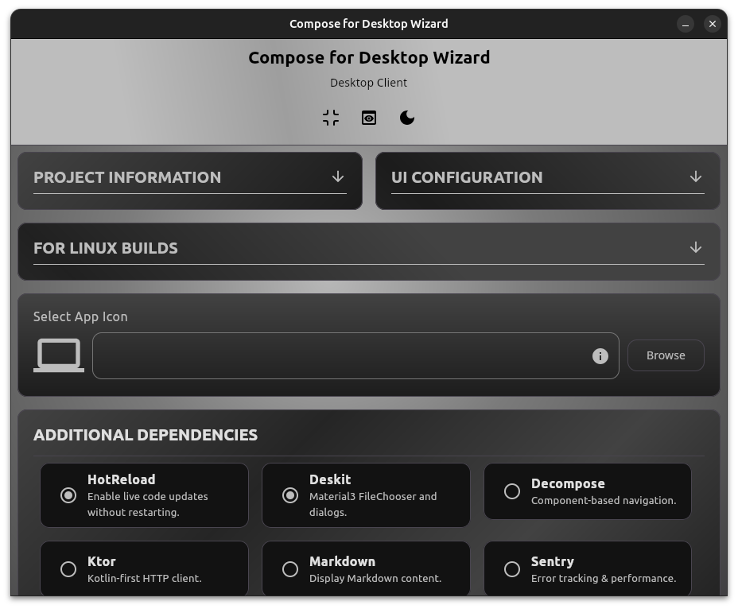

# Compose for Desktop Wizard - Desktop Client

[](https://kotlinlang.org)
[](https://www.jetbrains.com/lp/compose-multiplatform/)
[](https://www.oracle.com/java/technologies/javase/jdk17-archive-downloads.html)

A native desktop application for generating production-ready Kotlin Compose for Desktop projects, offline with advanced customization options and real-time preview.



## Features

- **Native Performance**: Built with Compose for Desktop for optimal performance
- **Advanced Configuration**: Comprehensive project setup with dependency management
- **Live Preview**: Real-time preview of generated files as you configure
- **Icon Management**: Drag-and-drop PNG icon support with automatic platform conversion(PNG -> ICO/ICNS)
- **Expandable Sections**: Organized UI with collapsible configuration sections
- **Dark Mode**: Full Material3 theming with dark mode support
- **Linux Integration**: Advanced DEB packaging with proper desktop integration

## Installation

### Prerequisites

Java 17 or later must be installed on your system. Download from [Oracle](https://www.oracle.com/java/technologies/javase/jdk17-archive-downloads.html).

### Linux

**Option 1: Debian Package from latest release**
- Download the .deb file from [releases page](https://github.com/zahid4kh/compose-for-desktop/releases) and install:
```bash
sudo dpkg -i composefordesktop_1.0.1_all.deb
```

**Option 2: JAR File**
- Download the JAR file from [releases page](https://github.com/zahid4kh/compose-for-desktop/releases)  and run:
```bash
java -jar composefordesktop-1.0.1.jar
```

### Windows & macOS

Download the JAR file from the [releases page](https://github.com/zahid4kh/compose-for-desktop/releases) and run:

```bash
java -jar composefordesktop-1.0.1.jar
```

For detailed installation instructions, see the [Installation Guide](https://github.com/zahid4kh/compose-for-desktop/wiki/Installation).

## Quick Start

1. Launch the application
2. Fill in your project details (App Name, Package Name, Version)
3. Configure UI settings (window dimensions)
4. Select additional dependencies as needed
5. Preview files that will be generated
6. Click "Generate Project" to create and download your ZIP file
7. Build with `./gradlew build`. For *Windows* use `./gradlew.bat build`

## Documentation

- **[Desktop Client Guide](https://github.com/zahid4kh/compose-for-desktop/wiki/Desktop-Client-Guide)** - Complete usage guide
- **[Installation Guide](https://github.com/zahid4kh/compose-for-desktop/wiki/Installation)** - Detailed installation instructions
- **[Architecture](https://github.com/zahid4kh/compose-for-desktop/wiki/Architecture)** - How the generator works
- **[Troubleshooting](https://github.com/zahid4kh/compose-for-desktop/wiki/Troubleshooting)** - Common issues and solutions

## Web Version

Also available as a web application at [composefordesktop.vercel.app](https://composefordesktop.vercel.app/) - no installation required.

## Requirements

- Java 17 or later

## Contributing

I welcome contributions.

## License

This project is licensed under the [Apache2.0 License](LICENSE).

---

**Generated projects include**: Gradle configuration, Material3 theming, dependency injection with Koin, MVVM architecture, cross-platform native distributions, and comprehensive build scripts with Linux desktop integration.